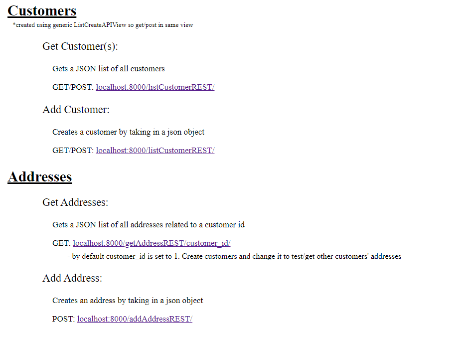
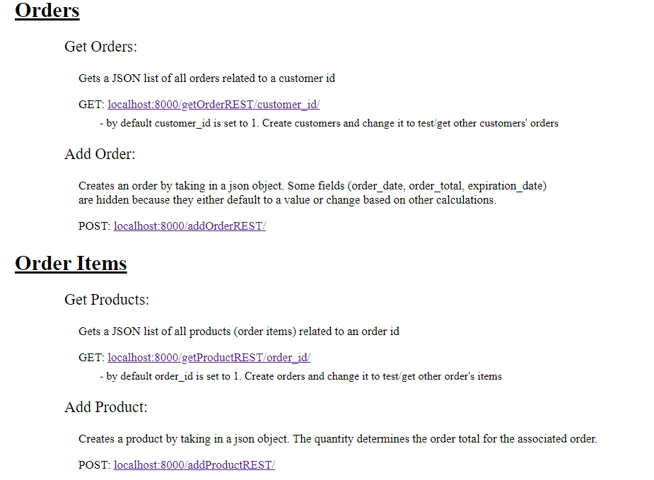
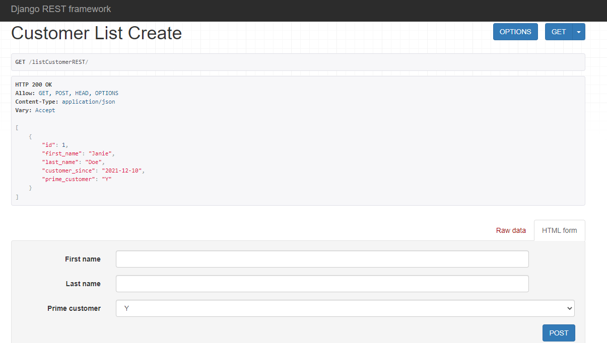
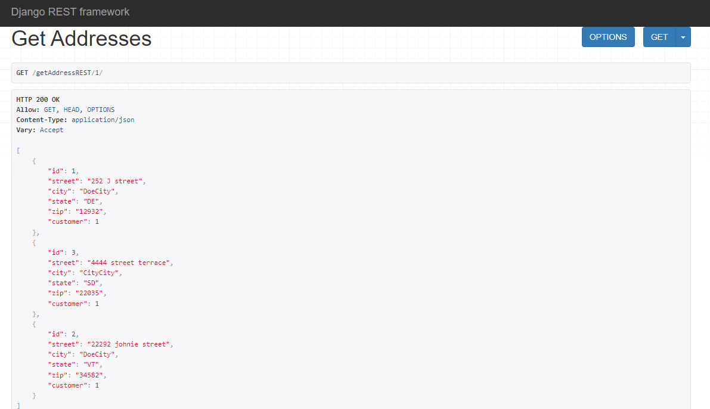

# django-rest-api-IT-409

API for an online shopping platform

---

### Learned
- Django API structure
- Django rest_framework module
- Django rest api views
- Django rest api viewsets
- Serializing using rest_framework's serializer module
- Models for rest api